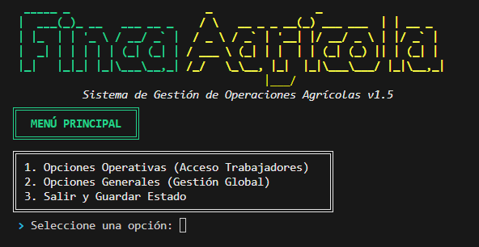

# Gestión de Finca Agricola TUI App

## Descripción
Aplicación de consola en Haskell para gestionar información de una finca agricola usando archivos locales.

## Objetivo
Practicar programación funcional aplicada a gestión con persistencia simple e interfaz textual.

## Tecnologías utilizadas
- Haskell
- Cabal
- Terminal
- Archivos .txt/.csv

## Funcionalidades principales
- Menu interactivo
- Persistencia en farm_data.txt y tools.csv
- Tipos de dominio
- UI/lógica/archivos separados

## Mi rol
Modelé datos, implementé operaciones y conecté interfaz textual con persistencia.

## Aprendizajes clave
- Tipos y módulos Haskell
- Archivos
- Menus de consola
- Separación funcional

## Instalación y ejecución
```bash
cd GestionDeFincaAgricola-TUIApp
cabal build
cabal run
```

## Estructura del proyecto
- app/Main.hs: entrada
- src/Menu.hs y UIUtils.hs: UI
- src/Logic.hs, Types.hs, Files.hs: dominio
- farm_data.txt/tools.csv: datos

## Capturas o demo


## Estado del proyecto
Proyecto académico funcional.

## Valor técnico demostrado
Demuestra uso practico de Haskell en gestión con modularidad.

## Mejoras futuras
- Eliminar compilados
- Agregar validaciónes
- Documentar formato de datos

## Autor
Geovanni González  
Estudiante de Ingeniería en Computación  
GitHub: [Geovanni-Gonzalez](https://github.com/Geovanni-Gonzalez)


